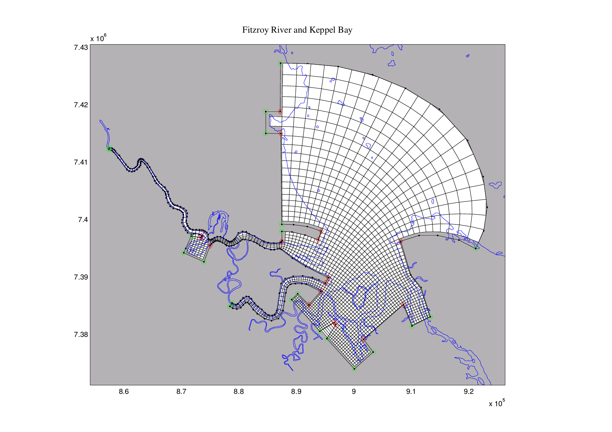

## gridgen ##

**gridgen** is a C code that provides a command line utility for non-interactive generation of multi-corner 
quasi-orthogonal grids inside simply connected polygonal regions. It is based on the 
[CRDT](http://gridgen-c.googlecode.com/files/crdt.pdf) algorithm that makes it possible to handle regions with 
elongated channels in a numerically robust way.

[Here](http://gridgen-c.googlecode.com/files/grid_examples.pdf) are some example grids from the **gridgen** package. You 
can also find a number of grids generated with *gridgen* for operational estuarine, coastal and regional models 
[here](http://code.google.com/p/gridgen-c/downloads/list).

Remember that **gridgen** is only a tool, and one needs quite a bit of skill to generate a particular grid. It used to 
take up to two weeks for me to generate a grid for an operational coastal or estuarine model (including testing a few 
candidates for stability and performance), but it is worth it.

If you are using **gridgen** you may also need [gridutils](https://github.com/sakov/gridutils-c) to work with the grids 
it produces.

There are a number of front-ends to **gridgen**. Two of them are [octant](https://github.com/hetland/octant) - a python 
suite for interactive grid generation for ROMS and GETM - and [pygridgen](https://github.com/hetland/pygridgen).

Checkout **gridgen** by running `git clone https://github.com/sakov/gridgen-c`
or `svn checkout https://github.com/sakov/gridgen-c`.

Example grid by gridgen:

